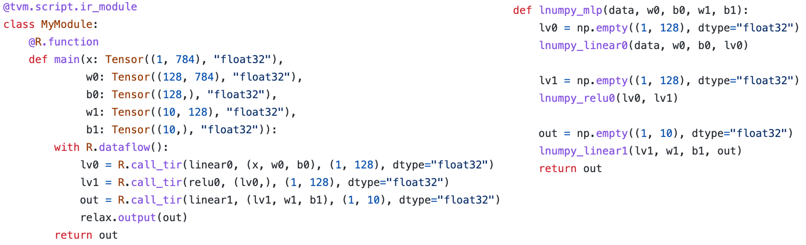
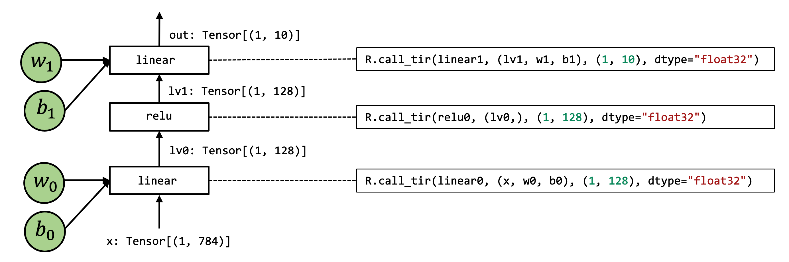
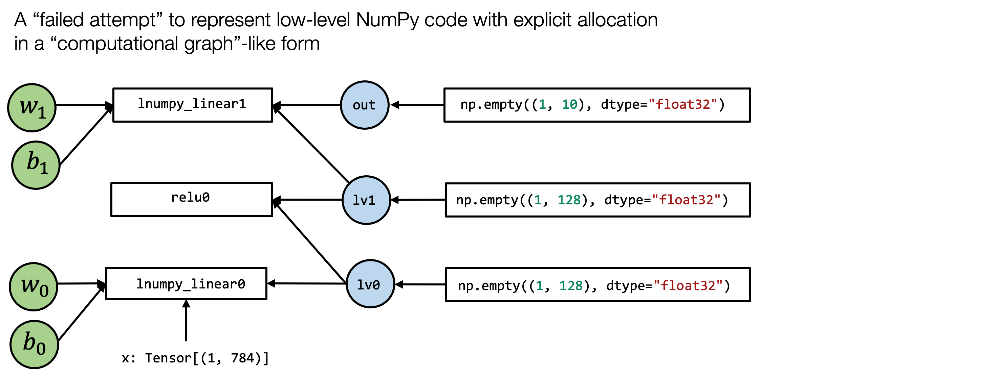

# 端到端模型执行

## 前言


大多数 MLC 过程可以看作是张量函数之间的转换。我们打算在上一节课中回答的主要问题是：

- 什么是可能的张量函数抽象表达形式？
- 什么是可能的张量函数变换？

在上一课中，我们主要关注点是元张量函数。在本次讲座中，我们将讨论如何构建端到端模型。

## 准备工作

首先，我们将导入必要的依赖项。

```{.python .input n=1}
import tvm
from tvm.ir.module import IRModule
from tvm.script import tir as T, relax as R
import numpy as np
from tvm import relax
# This is needed for deferring annotation parsing in TVMScript
from __future__ import annotations
import IPython
```

### 加载数据集

作为一个具体的例子，我们将在 fashion MNIST 数据集上使用一个模型。 以下代码从 `torchvision` 下载并准备数据并转换成NumPy数组。


```{.python .input n=1}
import torchvision
import torch
test_data = torchvision.datasets.FashionMNIST(
    root="data",
    train=False,
    download=True,
    transform=torchvision.transforms.ToTensor()
)
test_loader = torch.utils.data.DataLoader(test_data, batch_size=1, shuffle=True)
class_names = ['T-shirt/top', 'Trouser', 'Pullover', 'Dress', 'Coat',
               'Sandal', 'Shirt', 'Sneaker', 'Bag', 'Ankle boot']

img, label = next(iter(test_loader))
img = img.reshape(1, 28, 28).numpy()
```

我们可以绘制出我们希望能够预测的图像。

```{.python .input n=2}
import matplotlib.pyplot as plt

plt.figure()
plt.imshow(img[0])
plt.colorbar()
plt.grid(False)
plt.show()
print("Class:", class_names[label[0]])
```

### 下载模型参数

```{.python .input n=3}
# Hide outputs
!wget https://github.com/mlc-ai/web-data/raw/main/models/fasionmnist_mlp_params.pkl
```

## 端到端模型整合

在本章中，我们将使用以下模型作为示例。这是一个两层神经网络，由两个全连接层和一个有 relu 激活层组成。为了简化问题，我们删除了最终的 softmax 层。输出分数是未标准化的，但最大值仍然对应于最可能的类别。


让我们从模型的 Numpy 实现开始。

```{.python .input n=4}
def numpy_mlp(data, w0, b0, w1, b1):
    lv0 = data @ w0.T + b0
    lv1 = np.maximum(lv0, 0)
    lv2 = lv1 @ w1.T + b1
    return lv2
```

```{.python .input n=5}
import pickle as pkl
mlp_params = pkl.load(open("fasionmnist_mlp_params.pkl", "rb"))
res = numpy_mlp(img.reshape(1, 784),
                mlp_params["w0"],
                mlp_params["b0"],
                mlp_params["w1"],
                mlp_params["b1"])
print(res)
pred_kind = res.argmax(axis=1)
print(pred_kind)
print("NumPy-MLP Prediction:", class_names[pred_kind[0]])
```

上面的示例代码显示了利用高层NumPy数组操作，执行端到端模型执行的过程。

回到 MLC 的视角中，我们希望了解这些数组计算的细节。

为了说明底层细节，我们将再次用底层 NumPy 编写示例：

- 我们将在使用循环而不是数组函数来演示循环计算。
- 我们总是通过 `np.empty` 显式分配数组并传递它们。（不包含数组初始化）

下面的代码展示了同一模型的底层 NumPy 实现：

```{.python .input n=6}
def lnumpy_linear0(X: np.ndarray, W: np.ndarray, B: np.ndarray, Z: np.ndarray):
    Y = np.empty((1, 128), dtype="float32")
    for i in range(1):
        for j in range(128):
            for k in range(784):
                if k == 0:
                    Y[i, j] = 0
                Y[i, j] = Y[i, j] + X[i, k] * W[j, k]

    for i in range(1):
        for j in range(128):
            Z[i, j] = Y[i, j] + B[j]


def lnumpy_relu0(X: np.ndarray, Y: np.ndarray):
     for i in range(1):
        for j in range(128):
            Y[i, j] = np.maximum(X[i, j], 0)

def lnumpy_linear1(X: np.ndarray, W: np.ndarray, B: np.ndarray, Z: np.ndarray):
    Y = np.empty((1, 10), dtype="float32")
    for i in range(1):
        for j in range(10):
            for k in range(128):
                if k == 0:
                    Y[i, j] = 0
                Y[i, j] = Y[i, j] + X[i, k] * W[j, k]

    for i in range(1):
        for j in range(10):
            Z[i, j] = Y[i, j] + B[j]


def lnumpy_mlp(data, w0, b0, w1, b1):
    lv0 = np.empty((1, 128), dtype="float32")
    lnumpy_linear0(data, w0, b0, lv0)

    lv1 = np.empty((1, 128), dtype="float32")
    lnumpy_relu0(lv0, lv1)

    out = np.empty((1, 10), dtype="float32")
    lnumpy_linear1(lv1, w1, b1, out)
    return out

result =lnumpy_mlp(
    img.reshape(1, 784),
    mlp_params["w0"],
    mlp_params["b0"],
    mlp_params["w1"],
    mlp_params["b1"])

pred_kind = result.argmax(axis=1)
print("Low-level Numpy MLP Prediction:", class_names[pred_kind[0]])
```

## 在 TVMScript 中构建端到端 IRModule

考虑到低级 NumPy 示例，现在我们准备为端到端模型执行引入 MLC 抽象。 下面的代码块显示了模型的 TVMScript 实现。

有了底级 NumPy 代码作为参考，现在我们准备利用 MLC 抽象来实现端到端模型运行。下面的代码展示了模型的 TVMScript 实现。

```{.python .input n=7}
@tvm.script.ir_module
class MyModule:
    @T.prim_func
    def relu0(X: T.Buffer[(1, 128), "float32"],
              Y: T.Buffer[(1, 128), "float32"]):
        # function attr dict
        T.func_attr({"global_symbol": "relu0", "tir.noalias": True})
        for i, j in T.grid(1, 128):
            with T.block("Y"):
                vi, vj = T.axis.remap("SS", [i, j])
                Y[vi, vj] = T.max(X[vi, vj], T.float32(0))

    @T.prim_func
    def linear0(X: T.Buffer[(1, 784), "float32"],
                W: T.Buffer[(128, 784), "float32"],
                B: T.Buffer[(128,), "float32"],
                Z: T.Buffer[(1, 128), "float32"]):
        T.func_attr({"global_symbol": "linear0", "tir.noalias": True})
        Y = T.alloc_buffer((1, 128), "float32")
        for i, j, k in T.grid(1, 128, 784):
            with T.block("Y"):
                vi, vj, vk = T.axis.remap("SSR", [i, j, k])
                with T.init():
                    Y[vi, vj] = T.float32(0)
                Y[vi, vj] = Y[vi, vj] + X[vi, vk] * W[vj, vk]

        for i, j in T.grid(1, 128):
            with T.block("Z"):
                vi, vj = T.axis.remap("SS", [i, j])
                Z[vi, vj] =  Y[vi, vj] + B[vj]

    @T.prim_func
    def linear1(X: T.Buffer[(1, 128), "float32"],
                W: T.Buffer[(10, 128), "float32"],
                B: T.Buffer[(10,), "float32"],
                Z: T.Buffer[(1, 10), "float32"]):
        T.func_attr({"global_symbol": "linear1", "tir.noalias": True})
        Y = T.alloc_buffer((1, 10), "float32")
        for i, j, k in T.grid(1, 10, 128):
            with T.block("Y"):
                vi, vj, vk = T.axis.remap("SSR", [i, j, k])
                with T.init():
                    Y[vi, vj] = T.float32(0)
                Y[vi, vj] = Y[vi, vj] + X[vi, vk] * W[vj, vk]

        for i, j in T.grid(1, 10):
            with T.block("Z"):
                vi, vj = T.axis.remap("SS", [i, j])
                Z[vi, vj] = Y[vi, vj] + B[vj]

    @R.function
    def main(x: Tensor((1, 784), "float32"),
             w0: Tensor((128, 784), "float32"),
             b0: Tensor((128,), "float32"),
             w1: Tensor((10, 128), "float32"),
             b1: Tensor((10,), "float32")):
        with R.dataflow():
            lv0 = R.call_tir(linear0, (x, w0, b0), (1, 128), dtype="float32")
            lv1 = R.call_tir(relu0, (lv0,), (1, 128), dtype="float32")
            out = R.call_tir(linear1, (lv1, w1, b1), (1, 10), dtype="float32")
            R.output(out)
        return out
```

上面的代码包含各种函数：我们在上一课中看到的元张量函数（`T.prim_func`）和一个新的`R.function`（Relax 函数）。 Relax 函数是一种表示上层神经网络执行的全新抽象。

同样，对比查看 TVMScript 代码和底级 NumPy 代码会对我们理解代码有很大帮助。我们这里将详细介绍它们中的每一个元素。由于我们已经了解了元张量函数，因此我们将专注于高层的执行部分。




### 计算图



使用图 (graph) 来可视化高层模型执行通常很有帮助。 上图是 `main` 函数的计算图视图：

- 图中的每个框都对应于计算操作。
- 箭头对应于中间张量的输入输出。

我们在之前的课程中已经看到了这种可视化。 图本身可以看作是一种抽象，在机器学习框架中通常称为**计算图 (computational graph)**。

### `call_tir`

您可能已经注意到的一件事是，计算图中的每个操作步骤都包含一个`R.call_tir`操作。 这是引入元张量函数的过程：

```python
lv0 = R.call_tir(linear0, (x, w0, b0), (1, 128), dtype="float32")
```

为了解释 `R.call_tir` 的含义，让我们回顾一下操作的等效底层 NumPy 实现，如下所示：

```{.python .input n=8}
def lnumpy_call_tir(prim_func, inputs, shape, dtype):
    res = np.empty(shape, dtype=dtype)
    prim_func(*inputs, res)
    return res
```

具体来说，`call_tir` 接受一个元函数 (`prim_func`) 的输入列表，并分配一个输出张量`res`，然后将输入和输出传递给`prim_func`。 执行 `prim_func` 后，结果会填充到 `res` 中，然后我们可以返回结果。

请注意，`lnumpy_call_tir` 只是一个参考实现，以显示 `R.call_tir` 的含义。 在实际应用中，可以有不同的底层方法来优化执行。 例如，我们可能会选择提前分配所有输出内存，然后运行，我们将在以后的课程中介绍。

一个很自然的问题：为什么我们需要 `call_tir`？ 这是因为我们的元张量函数采用以下调用约定：

```python
def low_level_prim_func(in0, in1, ..., out):
    # implementations
```

此约定称为**目标传递 (destination passing)**。 这个想法是输入和输出在外部显式分配并传递给底层元函数。 这种风格通常用于底层库设计，因此高层框架可以处理内存分配决策。 请注意，并非所有张量操作都可以通过这种方式呈现（比如，有些操作的输出形状取决于输入）。 然而，在通常的实践中，如果可能的话，以这种风格编写底层函数通常是有帮助的。

虽然可以通过显式分配中间结果并调用每个函数来将目标传递的函数组装在一起，但很难将以下代码转换为计算图形式。

```python
def lnumpy_mlp(data, w0, b0, w1, b1):
    lv0 = np.empty((1, 128), dtype="float32")
    lnumpy_linear0(data, w0, b0, lv0)

    lv1 = np.empty((1, 128), dtype="float32")
    lnumpy_relu0(lv0, lv1)

    out = np.empty((1, 10), dtype="float32")
    lnumpy_linear1(lv1, w1, b1, out)
    return out
```



我们当然可以尝试一下 :) 上图是通过简单地将函数输入连接到函数来将`lnumpy_mlp`拟合成“类计算图”形式的一种可能的“失败尝试”。

我们可以发现它失去了之前计算图的一些特性。 具体来说，计算图通常具有以下性质：

- 框的每个输入边对应于操作的输入；
- 每个出边对应于操作的输出；
- 每个操作可以任意重新排序，直到边缘的拓扑顺序。

当然，我们仍然可以通过引入输入边和输出边来概括图定义，这会使抽象的定义和变换复杂化。

所以回到`call_tir`，这里的关键思想是我们想要隐藏可能的分配或对函数的显式写入。 用更正式的术语来说，我们希望函数是 **pure** 或 **side-effect free**。（译者注：“pure”和“side-effect”是 PL 中的术语，译者不确定中文的准确名称，故不进行翻译。欢迎社区中的专业人士参与完善）

如果一个函数只从其输入中读取并通过其输出返回结果，它不会改变程序的其他部分（例如递增全局计数器），那么它是**pure**或**side-effect free**的。

**call_tir** 使我们能够隐藏调用低层元函数细节，并将它们应用到计算图中。

我们还可以在底层 NumPy 中看到 `call_tir` 的作用。 现在我们已经定义了 `lnumpy_call_tir`，我们可以将底层 NumPy 代码重写为：

```{.python .input n=9}
def lnumpy_mlp_with_call_tir(data, w0, b0, w1, b1):
    lv0 = lnumpy_call_tir(lnumpy_linear0, (data, w0, b0), (1, 128), dtype="float32")
    lv1 = lnumpy_call_tir(lnumpy_relu0, (lv0, ), (1, 128), dtype="float32")
    out = lnumpy_call_tir(lnumpy_linear1, (lv1, w1, b1), (1, 10), dtype="float32")
    return out

result = lnumpy_mlp_with_call_tir(
    img.reshape(1, 784),
    mlp_params["w0"],
    mlp_params["b0"],
    mlp_params["w1"],
    mlp_params["b1"])

pred_kind = np.argmax(result, axis=1)
print("Low-level Numpy with CallTIR Prediction:", class_names[pred_kind[0]])
```

实际上，最底层的实现会有显式的内存分配，所以`call_tir`主要是为了让我们在生成实际实现之前继续做一些高层的转换。

### Dataflow Block

Relax 函数中的另一个重要元素是 `R.dataflow()` 范围标注：

```python
with R.dataflow():
    lv0 = R.call_tir(linear0, (x, w0, b0), (1, 128), dtype="float32")
    lv1 = R.call_tir(relu0, (lv0,), (1, 128), dtype="float32")
    out = R.call_tir(linear1, (lv1, w1, b1), (1, 10), dtype="float32")
    R.output(out)
```

这又回到了我们在上一节中讨论的**计算图**。 回想一下，在理想情况下，每个计算图操作都应该没有side-effect。

如果我们仍然想引入包含side-effect的操作怎么办？ dataflow block是我们标记程序计算图区域的一种方式。 具体来说，在dataflow block中，所有操作都需要side-effect free。 在dataflow block之外，操作可能包含side-effect。 下面的程序是一个包含两个dataflow block的示例程序。

```python
@R.function
def main(x: Tensor((1, 784), "float32"),
         w0: Tensor((128, 784), "float32"),
         b0: Tensor((128,), "float32"),
         w1: Tensor((10, 128), "float32"),
         b1: Tensor((10,), "float32")):

    with R.dataflow():
        lv0 = R.call_tir(linear0, (x, w0, b0), (1, 128), dtype="float32")
        gv0 = R.call_tir(relu0, (lv0,), (1, 128), dtype="float32")
        R.output(gv0)

    gv1 = R.alloc_tensor((1, 128), dtype="float32")

    with R.dataflow():
        out = R.call_tir(linear1, (gv0, gv1, b0), (1, 128), dtype="float32")
        R.output(out)
    return out
```

我们的大部分课程只会处理计算图（dataflow blocks），但最好能够理解背后的原因。

### 章节小结

到目前为止，我们已经完成了一个 Relax 程序的示例，并涵盖了大部分元素，包括：

- 计算图
- `call_tir`
- Dataflow block

这些元素应该让我们能够开始端到端的模型执行和编译。 当我们在后面的章节中遇到新概念时，我们还将介绍它们。

## 构建并运行模型

在上一节中，我们讨论了端到端模型执行的抽象。 本节介绍如何构建和运行 IRModule。 让我们首先回顾一下我们现有的 IRModule。

```{.python .input n=10}
IPython.display.Code(MyModule.script(), language="python")
```

我们调用 `relax.vm.build` 来构建这个函数。 注意：Relax 仍在开发中，因此某些 API 可能会更改。 不过，我们的主要目标是熟悉端到端模型的整体 MLC 流程（构造、转换、构建）。

```{.python .input n=11}
ex = relax.vm.build(MyModule, target="llvm")
type(ex)
```

build 函数会给我们一个可执行文件（译者注：“可执行文件”并非传统操作系统中的可执行文件，不能直接在系统中运行，而是针对Relax VM设计的一种文件格式）。 我们可以初始化一个虚拟机执行器，使我们能够运行该函数。 此外，我们将传入第二个参数，指示我们要在哪个设备上运行端到端执行。

```{.python .input n=12}
vm = relax.VirtualMachine(ex, tvm.cpu())
```

现在我们准备好运行模型了。 我们首先构建包含输入数据和权重的 tvm NDArray。

```{.python .input n=13}
data_nd = tvm.nd.array(img.reshape(1, 784))
nd_params = {k: tvm.nd.array(v) for k, v in mlp_params.items()}
```

然后我们可以通过传入输入参数和权重来运行 `main` 函数。

```{.python .input n=14}
nd_res = vm["main"](data_nd,
                    nd_params["w0"],
                    nd_params["b0"],
                    nd_params["w1"],
                    nd_params["b1"])
print(nd_res)
```

`main` 函数返回预测结果，然后我们可以调用`nd_res.numpy()`将其转换为 Numpy 数组，并取 `argmax` 获取类标签。

```{.python .input n=15}
pred_kind = np.argmax(nd_res.numpy(), axis=1)
print("MyModule Prediction:", class_names[pred_kind[0]])
```

## 在环境中集成现有运行库

在上一节中，我们展示了如何构建一个包含元张量函数实现以及计算图部分的 IRModule。 在许多情况下，我们可能希望将现有的库函数集成到 MLC 过程中。

下面的 IRModule 展示了如何做到这一点：

```{.python .input n=16}
@tvm.script.ir_module
class MyModuleWithExternCall:
    @R.function
    def main(x: Tensor((1, 784), "float32"),
             w0: Tensor((128, 784), "float32"),
             b0: Tensor((128,), "float32"),
             w1: Tensor((10, 128), "float32"),
             b1: Tensor((10,), "float32")):
        # block 0
        with R.dataflow():
            lv0 = R.call_tir("env.linear", (x, w0, b0), (1, 128), dtype="float32")
            lv1 = R.call_tir("env.relu", (lv0,), (1, 128), dtype="float32")
            out = R.call_tir("env.linear", (lv1, w1, b1), (1, 10), dtype="float32")
            R.output(out)
        return out
```

请注意，我们现在直接在 `call_tir` 中传入字符串：

```python
R.call_tir("env.linear", (x, w0, b0), (1, 128), dtype="float32")
```

这些字符串是我们期望在模型执行期间的运行时函数 (runtime function) 的名称。

### 注册运行时函数

为了能够执行调用外部函数的代码，我们需要注册相应的函数。 下面的代码注册了函数的两个实现：

```{.python .input n=17}
@tvm.register_func("env.linear", override=True)
def torch_linear(x: tvm.nd.NDArray,
                 w: tvm.nd.NDArray,
                 b: tvm.nd.NDArray,
                 out: tvm.nd.NDArray):
    x_torch = torch.from_dlpack(x)
    w_torch = torch.from_dlpack(w)
    b_torch = torch.from_dlpack(b)
    out_torch = torch.from_dlpack(out)
    torch.mm(x_torch, w_torch.T, out=out_torch)
    torch.add(out_torch, b_torch, out=out_torch)

@tvm.register_func("env.relu", override=True)
def lnumpy_relu(x: tvm.nd.NDArray,
                out: tvm.nd.NDArray):
    x_torch = torch.from_dlpack(x)
    out_torch = torch.from_dlpack(out)
    torch.maximum(x_torch, torch.Tensor([0.0]), out=out_torch)
```

在上面的代码中，我们使用 `from_dlpack` 将 TVM NDArray 转换为 torch NDArray。 请注意，这是一个零拷贝转换，这意味着 Torch 阵列与 TVM NDArray 共享底层内存。 DLPack 是一种通用的交换标准，允许不同的框架交换 Tensor/NDArray 而无需参与数据复制。 `from_dlpack` API 由多个框架支持，是 Python 数组 API 标准的一部分。 如果您有兴趣，可以阅读更多 [这里](https://dmlc.github.io/dlpack/latest/python_spec.html)。

在这个特定的函数中，我们只是简单地调用 PyTorch 的实现。 在真实的应用场景中，我们可以使用类似的机制将调用重定向到特定的库，例如 cuDNN 或我们自己的库实现。

这个特定示例在 Python 中执行注册。 实际上，我们可以用不同的语言（例如 C++）注册没有 Python 依赖的函数。 我们将在以后的课程中介绍更多内容。

### Build and Run

现在我们可以构建并运行`MyModuleWithExternCall`，我们可以验证模型得到了相同的结果。

```{.python .input n=18}
ex = relax.vm.build(MyModuleWithExternCall, target="llvm")
vm = relax.VirtualMachine(ex, tvm.cpu())

nd_res = vm["main"](data_nd,
                    nd_params["w0"],
                    nd_params["b0"],
                    nd_params["w1"],
                    nd_params["b1"])

pred_kind = np.argmax(nd_res.numpy(), axis=1)
print("MyModuleWithExternCall Prediction:", class_names[pred_kind[0]])
```

## Mixing TensorIR Code and Libraries

在上一个示例中，我们构建了一个 IRModule，其中所有元操作都被分派给运行库。有时将两者混合使用会有所帮助。


```{.python .input n=19}
@tvm.script.ir_module
class MyModuleMixture:
    @T.prim_func
    def linear0(X: T.Buffer[(1, 784), "float32"],
                W: T.Buffer[(128, 784), "float32"],
                B: T.Buffer[(128,), "float32"],
                Z: T.Buffer[(1, 128), "float32"]):
        T.func_attr({"global_symbol": "linear0", "tir.noalias": True})
        Y = T.alloc_buffer((1, 128), "float32")
        for i, j, k in T.grid(1, 128, 784):
            with T.block("Y"):
                vi, vj, vk = T.axis.remap("SSR", [i, j, k])
                with T.init():
                    Y[vi, vj] = T.float32(0)
                Y[vi, vj] = Y[vi, vj] + X[vi, vk] * W[vj, vk]

        for i, j in T.grid(1, 128):
            with T.block("Z"):
                vi, vj = T.axis.remap("SS", [i, j])
                Z[vi, vj] =  Y[vi, vj] + B[vj]

    @R.function
    def main(x: Tensor((1, 784), "float32"),
             w0: Tensor((128, 784), "float32"),
             b0: Tensor((128,), "float32"),
             w1: Tensor((10, 128), "float32"),
             b1: Tensor((10,), "float32")):
        with R.dataflow():
            lv0 = R.call_tir(linear0, (x, w0, b0), (1, 128), dtype="float32")
            lv1 = R.call_tir("env.relu", (lv0,), (1, 128), dtype="float32")
            out = R.call_tir("env.linear", (lv1, w1, b1), (1, 10), dtype="float32")
            R.output(out)
        return out
```

上面的代码块显示了一个示例，其中 `linear0` 仍然在 `TensorIR` 中实现，而其余函数被重定向到库函数。 我们可以构建并运行以验证结果。

```{.python .input n=20}
ex = relax.vm.build(MyModuleMixture, target="llvm")
vm = relax.VirtualMachine(ex, tvm.cpu())

nd_res = vm["main"](data_nd,
                    nd_params["w0"],
                    nd_params["b0"],
                    nd_params["w1"],
                    nd_params["b1"])

pred_kind = np.argmax(nd_res.numpy(), axis=1)
print("MyModuleMixture Prediction:", class_names[pred_kind[0]])
```

## 将参数绑定到 IRModule

在到目前为止的所有示例中，我们通过显式传递参数来构造主函数。 在许多情况下，将参数绑定为附加到 IRModule 的常量通常会降低API的复杂程度。 以下代码通过将参数名称与 nd_params 中的键匹配来创建绑定。

```{.python .input n=21}
MyModuleWithParams = relax.transform.BindParams("main", nd_params)(MyModuleMixture)
IPython.display.Code(MyModuleWithParams.script(), language="python")
```

在上面的脚本中，`meta[relay.Constant][0]` （译者注：目前 `Relax` 的常量表达依然继承自 `Relay` ，未来该 API 可能会更改） 对应于一个存储常量的隐式字典（它没有显示为脚本的一部分，但仍然是 IRModule 的一部分）。 如果我们构建转换后的 IRModule，我们现在可以通过传入输入数据来调用该函数。

```{.python .input n=22}
ex = relax.vm.build(MyModuleWithParams, target="llvm")
vm = relax.VirtualMachine(ex, tvm.cpu())

nd_res = vm["main"](data_nd)

pred_kind = np.argmax(nd_res.numpy(), axis=1)
print("MyModuleWithParams Prediction:", class_names[pred_kind[0]])
```

## 讨论

在本章中，我们讨论了许多描述端到端模型执行的方法。 我们可能已经注意到的一件事是我们回到了**抽象和实现**的主题。

- TensorIR 函数和库函数都遵循相同的目标传递方式。 因此，我们可以在示例中简单地将调用从一个替换为另一个。
- 我们可以使用不同的方式来表示 MLC 过程不同阶段的计算。

到目前为止，我们已经介绍了一些转换端到端 IRModule 的方法（例如参数绑定）。 让我们回到 MLC 的共同主题：MLC 过程是在不同的抽象表示之间执行并在它们之间进行转换。


端到端执行中有许多可能的转换。 例如，我们可以使用 `MyModuleMixture` 中的 `TensorIR` 函数，并使用上一课中讲授的调度操作更改 `linear0` 函数。 在其他情况下，我们可能希望将高层模型执行转换为库函数调用和 `TensorIR` 函数的混合体。

作为练习，请花一些时间思考可能希望在 IRModule 上执行哪些类型的转换。 我们也还将在未来介绍更多的转换。

在本章中，我们手动构建了 IRModule。 在实践中，一个真正的神经网络模型可以包含数百层，因此手动写出来是不可行的。 尽管如此，脚本格式仍然有助于我们了解正在发生的事情并进行交互式开发。 我们还将在以后的课程中了解更多以编程方式构建 IRModule 的方法。

## 总结

- 计算图抽象有助于将元张量函数拼接在一起以进行端到端执行。
- Relax 抽象的关键要素包括
   - call_tir 构造，将目标传递规范的元函数嵌入到计算图中
   - Dataflow block
- 计算图允许调用环境库函数和 `TensorIR` 函数。
