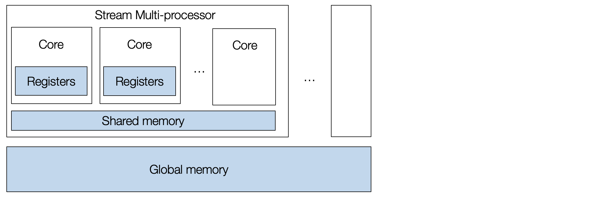
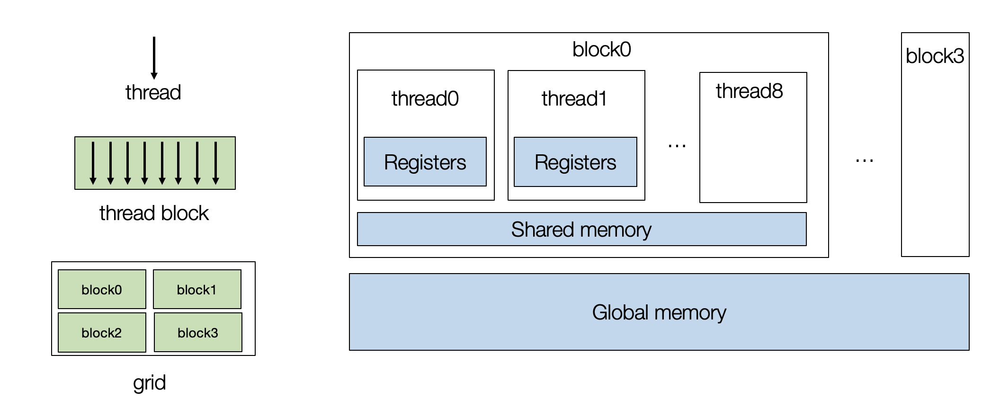
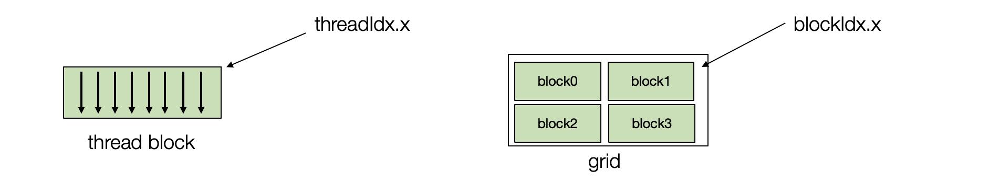
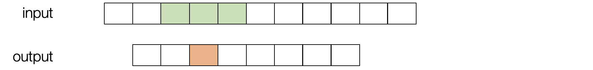
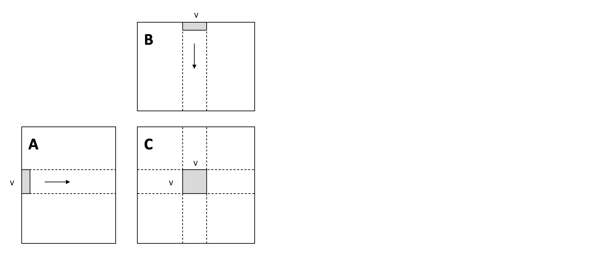
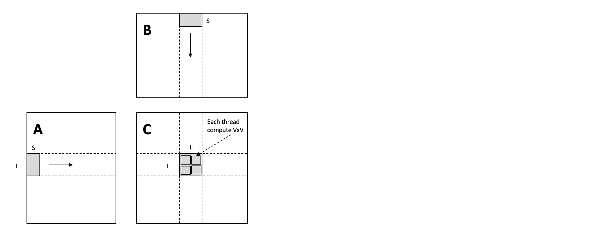

## 第一部分

在上一章中，我们讨论了 CPU 环境中的 MLC 流程。本章节将讨论如何将一些优化带到 GPU 上。我们将使用 CUDA 编程语言。然而，同样的概念也适用于其他类型的 GPU。

### 安装环境

在本课程中，我们将使用 TVM 中正在进行的一些开发。在**第一部分**中，我们依赖于 CUDA 11 环境，因此需要安装特定的包。

```bash
python3 -m pip install mlc-ai-nightly-cu110 -f https://mlc.ai/wheels
```

**注意：我们目前的系统尚不支持 GPU，因此部分代码不会被运行。**

### 准备工作

首先，让我们导入必要的依赖项。

```{.python .input}
import tvm
from tvm.ir.module import IRModule
from tvm.script import tir as T, relax as R
from tvm import relax
import numpy as np

# This is needed for deferring annotation parsing in TVMScript
from __future__ import annotations
```

### GPU 体系结构

让我们首先回顾一下 GPU 体系结构。典型的 GPU 包含一组流处理器 (stream multi-processors, SM)，每个流处理器都有许多核心。 GPU 设备是大规模并行的，允许我们同时执行许多任务。



要对 GPU 进行编程，我们需要创建一组线程块 (thread blocks)，每个 thread 映射到单个核心，而 block 映射到流式多处理器 (SM)。



让我们使用向量相加示例开始 GPU 编程。以下 TensorIR 程序采用两个向量 `A` 和 `B`，执行元素相加，并将结果存储在 `C` 中。

```{.python .input}
@tvm.script.ir_module
class MyModuleVecAdd:
    @T.prim_func
    def main(A: T.Buffer[(1024,), "float32"],
             B: T.Buffer[(1024,), "float32"],
             C: T.Buffer[(1024,), "float32"]) -> None:
        T.func_attr({"global_symbol": "main", "tir.noalias": True})
        for i in T.grid(1024):
            with T.block("C"):
                vi = T.axis.remap("S", [i])
                C[vi] = A[vi] + B[vi]
```

我们首先将循环 `i` 拆分成两个循环。

```{.python .input}
sch = tvm.tir.Schedule(MyModuleVecAdd)
block_C = sch.get_block("C")
i, = sch.get_loops(block=block_C)
i0, i1 = sch.split(i, [None, 128])
sch.mod.show()
```

#### GPU 线程块

然后我们将迭代器绑定到 GPU 线程块。 每个线程由两个索引进行表示 - `threadIdx.x` 和 `blockIdx.x`。 在实际应用中，我们可以有多维线程索引，但这里我们为了简化问题，将它们固定为一维表示。



```{.python .input}
sch.bind(i0, "blockIdx.x")
sch.bind(i1, "threadIdx.x")
sch.mod.show()
```

#### 在 GPU 上构建和运行 TensorIR 函数

我们可以在 GPU 上构建和测试生成的函数。

```python
rt_mod = tvm.build(sch.mod, target="cuda")

A_np = np.random.uniform(size=(1024,)).astype("float32")
B_np = np.random.uniform(size=(1024,)).astype("float32")
A_nd = tvm.nd.array(A_np, tvm.cuda(0))
B_nd = tvm.nd.array(B_np, tvm.cuda(0))
C_nd = tvm.nd.array(np.zeros((1024,), dtype="float32"), tvm.cuda(0))

rt_mod["main"](A_nd, B_nd, C_nd)
print(A_nd)
print(B_nd)
print(C_nd)
```

### 示例：窗口求和

现在，让我们继续看另一个例子——窗口总和。 这个程序可以被视为具有预定义权重 `[1,1,1]` 的“卷积“的基本版本。 我们对输入进行滑动并将三个相邻值相加。



```{.python .input}
@tvm.script.ir_module
class MyModuleWindowSum:
    @T.prim_func
    def main(A: T.Buffer[(1027,), "float32"],
             B: T.Buffer[(1024,), "float32"]) -> None:
        T.func_attr({"global_symbol": "main", "tir.noalias": True})
        for i in T.grid(1024):
            with T.block("C"):
                vi = T.axis.remap("S", [i])
                B[vi] = A[vi] + A[vi + 1] + A[vi + 2]
```

首先，我们可以将循环绑定到 GPU 线程。

```{.python .input}
sch = tvm.tir.Schedule(MyModuleWindowSum)
nthread = 128
block_C = sch.get_block("C")
i,  = sch.get_loops(block=block_C)
i0, i1 = sch.split(i, [None, nthread])
sch.bind(i0, "blockIdx.x")
sch.bind(i1, "threadIdx.x")
sch.mod.show()
```


重要的是，在这种情况下，有数据复用的机会 (reuse opportunities)。 请注意，每个 GPU 线程块都包含所有线程都可以在块内访问的共享内存 (shared memory)。 我们使用`cache_read`添加一个中间阶段，将部分数据（下面绿色）缓存到共享内存上。 缓存完成后，线程可以从共享内存中读取。

```{.python .input}
A_shared = sch.cache_read(block_C, read_buffer_index=0, storage_scope="shared")
sch.compute_at(A_shared, i1)
sch.mod.show()
```

因为内存是跨线程共享的，所以我们需要重新拆分循环并将获取过程的内部迭代器绑定到线程索引上。这种技术称为 **cooperative fetching**，其中多个线程一起工作以将数据带到共享内存中。下面的读取过程会与之前不同。

```{.python .input}
ax = sch.get_loops(A_shared)[-1]
ax0, ax1 = sch.split(ax, [None, nthread])
sch.bind(ax1, "threadIdx.x")
sch.mod.show()
```

我们可以检查相应的底层代码（CUDA 中）。 生成的代码包含两部分：

- 在主机 (CPU) 上的调用 GPU 程序的部分；
- 相应计算的 CUDA 内核。

我们可以使用以下代码打印出 CUDA 内核。 我们仍然需要主机和内核代码来运行程序，因此它只是一种快速检查最终代码生成结果的方法。

**值得注意的是，构建过程会自动压缩共享内存阶段以使用线程块中使用的最小区域。**

```python
rt_mod = tvm.build(sch.mod, target="cuda")
print(rt_mod.imported_modules[0].get_source())
```

#### 为其他 GPU 平台构建代码

MLC 过程通常支持针对多种硬件平台，我们可以通过改变目标参数来生成 Metal 代码（这是另一种 GPU 编程模型）。

```python
rt_mod = tvm.build(sch.mod, target="metal")
print(rt_mod.imported_modules[0].get_source())
```

### 矩阵乘法

现在让我们来处理一些稍微复杂的事情，并尝试在 GPU 上优化矩阵乘法。 我们将介绍两种用于 GPU 性能优化的常用技术。

```{.python .input}
@tvm.script.ir_module
class MyModuleMatmul:
    @T.prim_func
    def main(A: T.Buffer[(1024, 1024), "float32"],
             B: T.Buffer[(1024, 1024), "float32"],
             C: T.Buffer[(1024, 1024), "float32"]) -> None:
        T.func_attr({"global_symbol": "main", "tir.noalias": True})
        for i, j, k in T.grid(1024, 1024, 1024):
            with T.block("C"):
                vi, vj, vk = T.axis.remap("SSR", [i, j, k])
                with T.init():
                    C[vi, vj] = 0.0
                C[vi, vj] = C[vi, vj] + A[vi, vk] * B[vk, vj]
```

#### 本地存储分块 (Local Blocking)



我们可以进行循环拆分，来增加整体内存复用。特别是，我们引入了局部切分，这样我们只需要从 `A` 和 `B` 加载一次条形数据（上图中的灰色部分），然后使用它们来执行 $V \times V$ 矩阵乘法结果。

这种本地存储的切分有助于减少内存压力，因为条形数据块的每个元素都被重用了 `V` 次。

```{.python .input}
def blocking(sch,
             tile_local_y,
             tile_local_x,
             tile_block_y,
             tile_block_x,
             tile_k):
    block_C = sch.get_block("C")
    C_local = sch.cache_write(block_C, 0, "local")

    i, j, k = sch.get_loops(block=block_C)

    i0, i1, i2 = sch.split(loop=i, factors=[None, tile_block_y, tile_local_y])
    j0, j1, j2 = sch.split(loop=j, factors=[None, tile_block_x, tile_local_x])
    k0, k1 = sch.split(loop=k, factors=[None, tile_k])
    sch.unroll(k1)
    sch.reorder(i0, j0, i1, j1, k0, k1, i2, j2)
    sch.reverse_compute_at(C_local, j1)

    sch.bind(i0, "blockIdx.y")
    sch.bind(j0, "blockIdx.x")

    sch.bind(i1, "threadIdx.y")
    sch.bind(j1, "threadIdx.x")
    sch.decompose_reduction(block_C, k0)

    return sch

sch = tvm.tir.Schedule(MyModuleMatmul)
sch = blocking(sch, 8, 8, 8, 8, 4)
sch.mod.show()
```

```python
rt_mod = tvm.build(sch.mod, target="cuda")
dev = tvm.cuda(0)
A_np = np.random.uniform(size=(1024, 1024)).astype("float32")
B_np = np.random.uniform(size=(1024, 1024)).astype("float32")
A_nd = tvm.nd.array(A_np, dev)
B_nd = tvm.nd.array(B_np, dev)
C_nd = tvm.nd.array(np.zeros((1024, 1024), dtype="float32"), dev)

num_flop = 2 * 1024 * 1024 * 1024
evaluator = rt_mod.time_evaluator("main", dev, number=10)

print("GEMM-Blocking: %f GFLOPS" % (num_flop / evaluator(A_nd, B_nd, C_nd).mean / 1e9))
```

### 共享内存分块 (Shared Memory Blocking)



我们的第一次尝试没有考虑位于同一个 GPU 线程块中的相邻线程，我们可以将它们需要的数据加载到一块共享内存 (shared memory) 中。

下面的转换完成了这项操作：

```{.python .input}
def cache_read_and_coop_fetch(sch, block, nthread, read_idx, read_loc):
    read_cache = sch.cache_read(block=block, read_buffer_index=read_idx, storage_scope="shared")
    sch.compute_at(block=read_cache, loop=read_loc)
    # vectorized cooperative fetch
    inner0, inner1 = sch.get_loops(block=read_cache)[-2:]
    inner = sch.fuse(inner0, inner1)
    _, tx, vec = sch.split(loop=inner, factors=[None, nthread, 4])
    sch.vectorize(vec)
    sch.bind(tx, "threadIdx.x")


def blocking_with_shared(
    sch,
    tile_local_y,
    tile_local_x,
    tile_block_y,
    tile_block_x,
    tile_k):
    block_C = sch.get_block("C")
    C_local = sch.cache_write(block_C, 0, "local")

    i, j, k = sch.get_loops(block=block_C)

    i0, i1, i2 = sch.split(loop=i, factors=[None, tile_block_y, tile_local_y])
    j0, j1, j2 = sch.split(loop=j, factors=[None, tile_block_x, tile_local_x])
    k0, k1 = sch.split(loop=k, factors=[None, tile_k])

    sch.reorder(i0, j0, i1, j1, k0, k1, i2, j2)
    sch.reverse_compute_at(C_local, j1)

    sch.bind(i0, "blockIdx.y")
    sch.bind(j0, "blockIdx.x")

    tx = sch.fuse(i1, j1)
    sch.bind(tx, "threadIdx.x")
    nthread = tile_block_y * tile_block_x
    cache_read_and_coop_fetch(sch, block_C, nthread, 0, k0)
    cache_read_and_coop_fetch(sch, block_C, nthread, 1, k0)
    sch.decompose_reduction(block_C, k0)

    return sch

sch = tvm.tir.Schedule(MyModuleMatmul)
sch = blocking_with_shared(sch, 8, 8, 8, 8, 8)
sch.mod.show()
```

```python
rt_mod = tvm.build(sch.mod, target="cuda")
dev = tvm.cuda(0)
evaluator = rt_mod.time_evaluator("main", dev, number=10)

print("GEMM-Blocking: %f GFLOPS" % (num_flop / evaluator(A_nd, B_nd, C_nd).mean / 1e9))
```

### 利用自动程序优化

到目前为止，我们一直在手动编写变换来优化 GPU 上的 TensorIR 程序。我们可以利用自动程序优化框架来调整相同的程序。下面的代码就是这样做的，我们这里设置了一个较小的搜索次数，可能需要几分钟才能完成。

```python
from tvm import meta_schedule as ms

sch_tuned = ms.tune_tir(
    mod=MyModuleMatmul,
    target="nvidia/tesla-p100",
    config=ms.TuneConfig(
      max_trials_global=64,
      num_trials_per_iter=64,
    ),
    work_dir="./tune_tmp",
    task_name="main"
)
sch_tuned.mod.show()
```

```python
rt_mod = tvm.build(sch_tuned.mod, target="nvidia/tesla-p100")
dev = tvm.cuda(0)
evaluator = rt_mod.time_evaluator("main", dev, number=10)

print("MetaSchedule: %f GFLOPS" % (num_flop / evaluator(A_nd, B_nd, C_nd).mean / 1e9))
```

### 小结

本章研究 MLC 的另一个维度，即我们如何变换我们的程序以实现硬件加速。MLC 过程帮助我们将输入模型连接到不同的 GPU 编程模型和环境。 我们还将在接下来的章节中访问更多专业硬件加速主题。

- 典型的 GPU 包含两级层次结构。 每个线程由（在 CUDA 术语中）`threadIdx.x` 和 `blockIdx.x` 索引（也可以有多个维度索引，但它们可以融合为一个）。
- 共享内存有助于缓存同一块内的线程中常用的数据。
- 在 GPU 优化期间鼓励内存重用。
