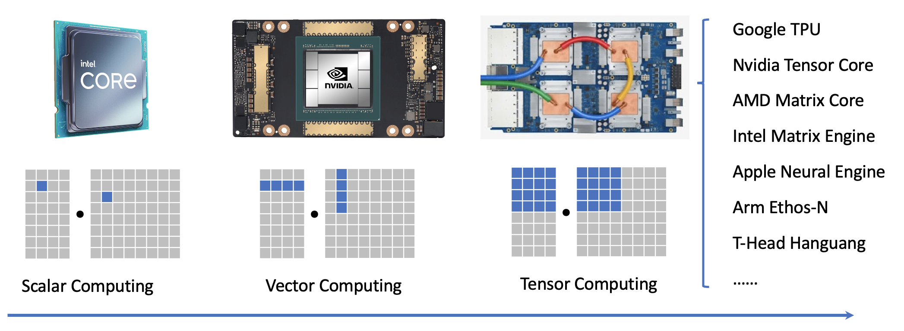

## 第二部分

我们在过去的章节中讨论了为 CPU 和 GPU 环境构建机器学习编译流程。本节重点介绍我们如何为专门的硬件后端构建概念编程模型。

### 准备工作

首先，让我们导入必要的依赖项。

```{.python .input}
import tvm
from tvm.ir.module import IRModule
from tvm.script import tir as T, relax as R
from tvm import relax
import numpy as np

# This is needed for deferring annotation parsing in TVMScript
from __future__ import annotations 
```

### 硬件专业化趋势



如果我们看看机器学习硬件领域，可以发现最近一个新兴的主题是专业化。传统上，我们在通用标量处理器上构建我们的解决方案：我们可以一次在一个浮点上执行操作。AVX 和 ARM/Neon 等向量指令集提供了加速程序的有效方法，但也给我们编写程序的方式带来了一些复杂性。

最新的机器学习加速器引入了用于张量计算的专用单元，以及用于多维数据复制和矩阵/张量计算的指令。

#### 专业化代码中的关键要素

为了帮助我们更好地理解专业硬件编程的元素，让我们首先研究以下 **low-level NumPy** 代码。 虽然这段代码仍然在 Python 中运行，但它类似于一组可能发生在专用硬件后端的操作。

```{.python .input}
def accel_fill_zero(C):
    C[:] = 0

def accel_tmm_add(C, A, B):
    C[:] += A @ B.T

def accel_dma_copy(reg, dram):
    reg[:] = dram[:]

def lnumpy_tmm(A: np.ndarray, B: np.ndarray, C: np.ndarray):
    # a special accumulator memory
    C_accumulator = np.empty((16, 16), dtype="float32")
    A_reg = np.empty((16, 16), dtype="float32")
    B_reg = np.empty((16, 16), dtype="float32")

    for i in range(64):
        for j in range(64):
            accel_fill_zero(C_accumulator[:,:])
            for k in range(64):
                accel_dma_copy(A_reg[:], A[i * 16 : i * 16 + 16, k * 16 : k * 16 + 16])
                accel_dma_copy(B_reg[:], B[j * 16 : j * 16 + 16, k * 16 : k * 16 + 16])
                accel_tmm_add(C_accumulator[:,:], A_reg, B_reg)
            accel_dma_copy(C[i * 16 : i * 16 + 16, j * 16 : j * 16 + 16], C_accumulator[:,:])
```


上面的低级 NumPy 程序包含以下关键元素：

- 计算的基本单位是 16x16x16 矩阵乘法 (`accel_tmm_add`)
- `accel_tmm_add` 接受两个输入 —— `A_reg` 和 `B_reg` 并累加到累加器内存中。
- 使用特殊功能 (`accel_dma_copy`) 执行数据复制。

在现实世界的硬件后端中，我们通常期望 `A_reg`、`B_reg` 和 `C_accumulator` 映射到硬件中的特殊内存区域（或寄存器）。这些被称为**特殊内存层级**。 此外，我们可以对这些设置执行一组有限的硬件加速操作。 诸如 `accel_tmm_add` 之类的操作可以映射到真正的硬件指令或供应商提供的高效内核函数实现。

我们可以运行以下代码块来确认低级 NumPy 代码是否正确运行。

```{.python .input}
dtype = "float32"
a_np = np.random.rand(1024, 1024).astype(dtype)
b_np = np.random.rand(1024, 1024).astype(dtype)
c_tmm = a_np @ b_np.T
```

```{.python .input}
c_np = np.empty((1024, 1024), dtype="float32")
lnumpy_tmm(a_np, b_np, c_np)
np.testing.assert_allclose(c_np, c_tmm, rtol=1e-5)
```

#### 带有张量化计算的 block

我们的主要观察之一是专用加速器代码不是以标量计算为单位构建的。到目前为止，我们运行的大多数 TensorIR 代码都包含一个 block，用于计算输出张量中的单个元素。许多专门的加速器在张量区域上运行计算。 TensorIR 中的 block 结构帮助我们对此类相关计算进行分组。

```{.python .input}
@tvm.script.ir_module
class MatmulBlockModule:
    @T.prim_func
    def main(
        A: T.Buffer[(1024, 1024), "float32"],
        B: T.Buffer[(1024, 1024), "float32"],
        C: T.Buffer[(1024, 1024), "float32"],
    ) -> None:
        T.func_attr({"global_symbol": "main", "tir.noalias": True})
        for i0, j0, k0 in T.grid(64, 64, 64):
            with T.block("tmm-16x16"):
                vi0, vj0, vk0 = T.axis.remap("SSR", [i0, j0, k0])
                with T.init():
                    for i1, j1 in T.grid(16, 16):
                        with T.block("tmm_init"):
                            vi1, vj1 = T.axis.remap("SS", [i1, j1])
                            C[vi0 * 16 + vi1, vj0 * 16 + vj1] = T.float32(0)
                
                for i1, j1, k1 in T.grid(16, 16, 16):
                    with T.block("tmm"):
                        vi1, vj1, vk1 = T.axis.remap("SSR", [i1, j1, k1])
                        C[vi0 *16 + vi1, vj0 * 16 + vj1] += \
                            A[vi0 * 16 + vi1, vk0 * 16 + vk1] * B[vj0 * 16 + vj1, vk0 * 16 + vk1]
```

```{.python .input}
MatmulBlockModule.show()
```

我们进一步观察下面这个 block：

```python
with T.block("tmm-16x16"):
    T.reads(A[vi0 * 16 : vi0 * 16 + 16, vk0 * 16 : vk0 * 16 + 16], B[vj0 * 16 : vj0 * 16 + 16, vk0 * 16 : vk0 * 16 + 16])
    T.writes(C[vi0 * 16 : vi0 * 16 + 16, vj0 * 16 : vj0 * 16 + 16])
    ...
```

这个 block 从 `A` 和 `B` 的 16x16 区域读取，并写入 `C` 的 16x16 区域。 在这种情况下，block 的内容包含有关子区域计算的特定实现的更多细节。 我们将此 block 称为**张量化 block**，因为它们包含跨越张量子区域的计算。

我们可以运行以下代码来确认 TensorIR 模块产生了正确的结果。

```{.python .input}
a_nd = tvm.nd.array(a_np)
b_nd = tvm.nd.array(b_np)

c_nd = tvm.nd.empty((1024, 1024), dtype="float32")

lib = tvm.build(MatmulBlockModule, target="llvm")
lib["main"](a_nd, b_nd, c_nd)
np.testing.assert_allclose(c_nd.numpy(), c_tmm, rtol=1e-5)
```

#### 变换在张量化 block 周围的循环

我们在这里可以做的一件事是变换张量计算 block 周围的循环。这些循环变换可以帮助我们重新组织周围的迭代方式，从而使得不同张量程序变体成为可能。

```{.python .input}
sch = tvm.tir.Schedule(MatmulBlockModule)

block_mm = sch.get_block("tmm-16x16")
i, j, k = sch.get_loops(block_mm)

i0, i1 = sch.split(i, [None, 4])

sch.reorder(i0, j, i1, k)
sch.mod.show()
```

#### Blockization -- 创造新的 block

在大多数情况下，我们从带有标量计算的循环开始。 TensorIR 提供了一种变换原语 blockization 来将循环的子区域组合在一起以形成张量化的计算 block。

```{.python .input}
@tvm.script.ir_module
class MatmulModule:
    @T.prim_func
    def main(
        A: T.Buffer[(1024, 1024), "float32"],
        B: T.Buffer[(1024, 1024), "float32"],
        C: T.Buffer[(1024, 1024), "float32"],
    ) -> None:
        T.func_attr({"global_symbol": "main", "tir.noalias": True})
        for i, j, k in T.grid(1024, 1024, 1024):
            with T.block("matmul"):
                vi, vj, vk = T.axis.remap("SSR", [i, j, k])
                with T.init():
                    C[vi, vj] = T.float32(0)
                C[vi, vj] += A[vi, vk] * B[vj, vk]
```

```{.python .input}
sch = tvm.tir.Schedule(MatmulModule)
i, j, k = sch.get_loops("matmul")
i, ii = sch.split(i, factors=[None, 16])
j, ji = sch.split(j, factors=[None, 16])
k, ki = sch.split(k, factors=[None, 16])
sch.reorder(i, j, k, ii, ji, ki)
sch.mod.show()
```

```{.python .input}
block_mm = sch.blockize(ii)
sch.mod.show()
```

#### 变换 TensorIR 以引入特殊内存层级

正如我们在低级 NumPy 代码中所指出的，之前低级 TensorIR 的一个关键元素是加速期间使用的特殊内存层级。

我们可以使用 `cache_read` 和 `cache_write` 来创建中间内存阶段。

```{.python .input}
A_reg = sch.cache_read(block_mm, 0, storage_scope="global.A_reg")
B_reg = sch.cache_read(block_mm, 1, storage_scope="global.B_reg")
sch.compute_at(A_reg, k)
sch.compute_at(B_reg, k)

write_back_block = sch.cache_write(block_mm, 0, storage_scope="global.accumulator")
sch.reverse_compute_at(write_back_block, j)
sch.mod.show()
```


这里 `global.A_reg` 包含两个部分。 `global` 表示所有线程都可以全局访问内存，而 `A_reg` 是内存的**层级标签**，为后续编译映射到寄存器等特殊区域提供了机会。

### 张量化

现在我们已经创建了一组映射到 TensorIR 中相应计算阶段的 block。 剩下的步骤是映射一些 block 以使用映射到硬件加速指令的特定实现。 此映射过程称为**张量化**。

为了准备张量化，我们首先注册一个张量 intrinsic（TensorIntrin），其中包含计算和实现的描述。

系统将使用描述找到与计算匹配的相关区域，而实现将计算映射到加速硬件指令。

```{.python .input}
@T.prim_func
def tmm16_desc(a: T.handle, b: T.handle, c: T.handle) -> None:
    A = T.match_buffer(a, (16, 16), "float32", offset_factor=16, scope="global.A_reg")
    B = T.match_buffer(b, (16, 16), "float32", offset_factor=16, scope="global.B_reg")
    C = T.match_buffer(c, (16, 16), "float32", offset_factor=16,  scope="global.accumulator")

    with T.block("root"):
        T.reads(C[0:16, 0:16], A[0:16, 0:16], B[0:16, 0:16])
        T.writes(C[0:16, 0:16])
        for i, j, k in T.grid(16, 16, 16):
            with T.block(""):
                vii, vjj, vkk = T.axis.remap("SSR", [i, j, k])
                C[vii, vjj] = C[vii, vjj] + A[vii, vkk] * B[vjj, vkk]


@T.prim_func
def tmm16_impl(a: T.handle, b: T.handle, c: T.handle) -> None:
    sa = T.var("int32")
    sb = T.var("int32")
    sc = T.var("int32")
    A = T.match_buffer(a, (16, 16), "float32", offset_factor=16, strides=[sa, 1], scope="global.A_reg")
    B = T.match_buffer(b, (16, 16), "float32", offset_factor=16, strides=[sb, 1], scope="global.B_reg")
    C = T.match_buffer(c, (16, 16), "float32", offset_factor=16, strides=[sc, 1], scope="global.accumulator")

    with T.block("root"):
        T.reads(C[0:16, 0:16], A[0:16, 0:16], B[0:16, 0:16])
        T.writes(C[0:16, 0:16])
        T.evaluate(
            T.call_extern(
                "tmm16",
                C.access_ptr("w"),
                A.access_ptr("r"),
                B.access_ptr("r"),
                sa,
                sb,
                sc,
                dtype="int32",
            )
        )

tvm.tir.TensorIntrin.register("tmm16", tmm16_desc, tmm16_impl)
```

作为准备步骤，我们首先将归约分解为一个初始化 block 和一个更新 block。

```{.python .input}
sch.decompose_reduction(block_mm, k)
sch.mod.show()
```

然后我们可以调用 `tensorize`，将 `block_mm`（对应于 `matmul_o_update` block）映射到使用 `tmm16` 的实现。

```{.python .input}
sch.tensorize(block_mm, "tmm16")
```

```{.python .input}
sch.mod.show()
```

这里我们使用 `T.call_extern` 来调用环境中的外部函数。 下游编译步骤可以轻松地将实现映射到实现操作的指令。

或者，我们可以将 `tmm16` 映射到实现这种张量化计算的微内核。 以下代码显示了如何通过外部 C 代码执行此操作（如果需要，可以进一步嵌入内联汇编）。

```{.python .input}
def tmm_kernel():
    cc_code = """
      extern "C" int tmm16(float *cc, float *aa, float *bb, int stride_a, int stride_b, int stride_c) {
        for (int i = 0; i < 16; ++i) {
            for (int j = 0; j < 16; ++j) {
                for (int k = 0; k < 16; ++k) {
                    cc[i * stride_c + j] += aa[i * stride_a + k] * bb[j * stride_b + k];
                }
            }
        }
        return 0;
      }
    """
    from tvm.contrib import utils, clang

    temp = utils.tempdir()
    ll_path = temp.relpath("temp.ll")
    # Create LLVM ir from c source code
    ll_code = clang.create_llvm(cc_code, output=ll_path)
    return ll_code

sch.annotate(i, "pragma_import_llvm", tmm_kernel())
```

然后我们可以去执行下面的代码块，它将张量化的计算重定向到自定义的 `tmm_kernel`。

```{.python .input}
a_nd = tvm.nd.array(a_np)
b_nd = tvm.nd.array(b_np)

c_nd = tvm.nd.empty((1024, 1024), dtype="float32")

lib = tvm.build(sch.mod, target="llvm")
lib["main"](a_nd, b_nd, c_nd)
np.testing.assert_allclose(c_nd.numpy(), c_tmm, rtol=1e-5)
```

### 讨论

本节介绍了一组专用硬件支持的关键元素。 这里的关键结构之一是张量化 block 和计算以及张量子区域。 TensorIR 还包含建立在基础元素之上的其他属性：

- 专用内存中的布局约束。
- 与线程层次结构的交互。

我们没有足够的时间在一次讲座中涵盖这些内容，但我们将在一些附加内容上添加可选读物。

### 小结

- 硬件专业化向张量计算的总体趋势。
- 带有张量化 block 的 TensorIR 变换。
- 张量化：将循环计算 block 映射到专门实现的过程。
