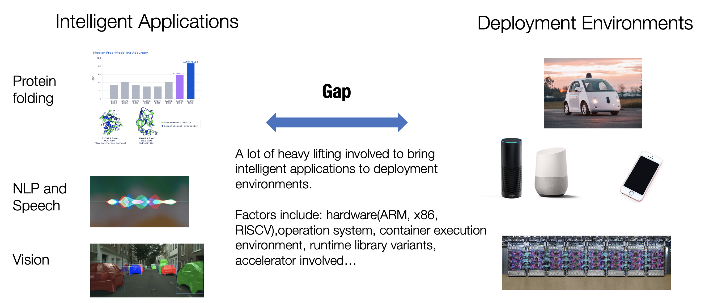
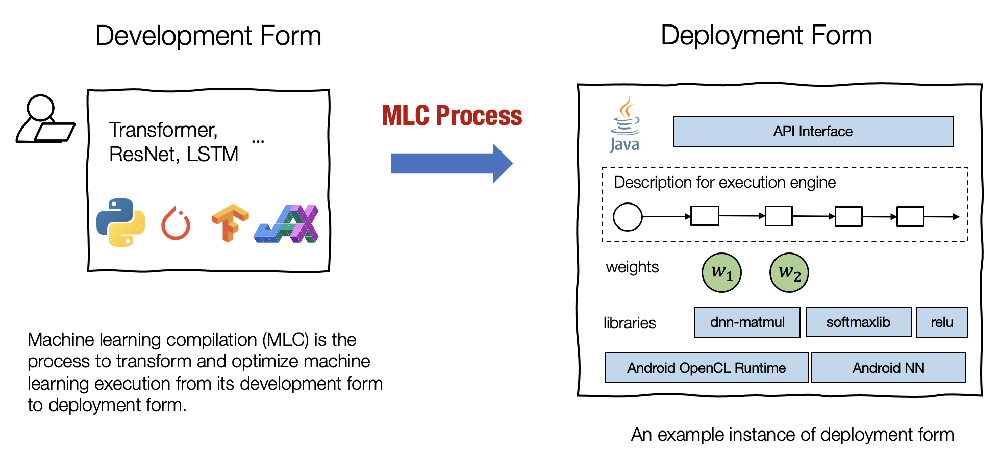
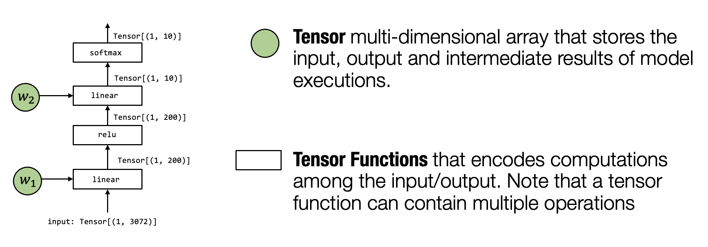
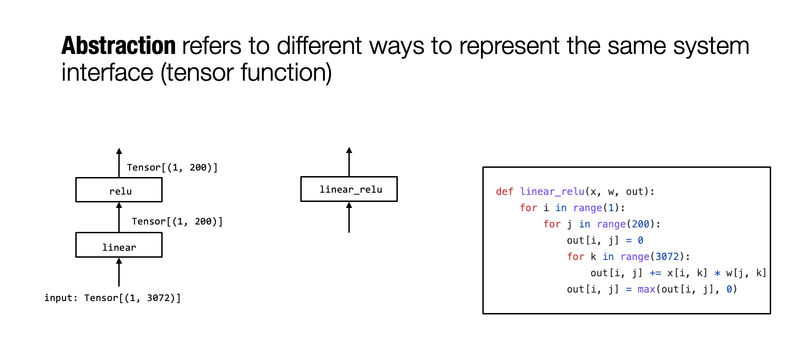

# 概述

:label:`chap_introduction`

机器学习应用程序已经无处不在。我们的智能家居设备由自然语言处理（NLP）和语音识别模型驱动，自动驾驶技术以计算机视觉模型为支柱，还有推荐系统帮助我们在探索时发现新内容。
同样有趣的是AI应用的部署环境是非常丰富的。推荐系统算法通常由大型公司部署在云平台上；当我们谈论自动驾驶时，我们首先想到的是强大的 GPU 或车辆上的专用计算设备；我们使用手机上的智能应用程序来识别花园中的花朵以及如何照料它们；以及越来越多的物联网传感器也在内置微型芯片中运行着简单的AI算法。
如果我们深入研究这些环境，就会涉及到更多环境多样性。即使对于属于同一类别的环境（例如云​​），也存在关于硬件（ARM 或 x86）、操作系统、容器执行环境、运行时计算库 (Runtime Libraries) 或所涉及的加速器类型的问题。
将智能机器学习模型从研发阶段转而部署到这些多样的生产环境，需要相当多的繁重工作。即使对于我们最熟悉的环境（例如在 GPU 上），部署包含非标准算子的深度学习模型仍然需要大量的工程。
上述许多例子都与机器学习推理相关——即在获得模型权重后进行预测的过程。同时，我们还发现将训练 (Training) 过程本身部署到不同环境会变得越来越重要。这些需求源于出于隐私保护原因，或将模型学习扩展到分布式节点集群的需要，或需要将模型更新保持在用户设备的本地。不同的建模选择和推理/训练场景为机器学习的生产和部署增加了更多的复杂性。

:label:`fig_intro_gap`

本课程将讨论如何把机器学习从开发、研究阶段，引入到生产环境。我们将讨论一系列促进机器学习算法落地部署的方法。由于机器学习和开源系统正在开发新技术，机器学习落地部署仍然是一个开放且活跃的领域。然而，我们开始看到一些共性问题和话题，最终成为本课程的主题。

## 什么是机器学习编译

机器学习编译 (machine learning compilation, MLC) 是指，将机器学习算法从开发阶段，通过变换和优化算法，使其变成部署状态。

**开发形式** 是指我们在开发机器学习模型时使用的形式。典型的开发形式包括用 PyTorch、TensorFlow 或 JAX 等通用框架编写的模型描述，以及与之相关的权重。

**部署形式** 是指执行机器学习应用程序所需的形式。它通常涉及机器学习模型的每个步骤的支撑代码、管理资源（例如内存）的控制器，以及与应用程序开发环境的接口（例如用于 android 应用程序的 java API）。

:label:`fig_dev_deploy_form`

我们使用术语“编译 (compilation)”，因为可以将这个过程视为与传统编译器所做的非常相似的过程，即编译器将我们的应用程序采用开发形式，并将它们编译为可以部署的库。但是，机器学习编译在很多方面仍然不同于传统编译。

首先，这个过程不一定涉及代码生成。例如，部署形式可以是一组预定义的库函数，而 ML 编译仅将开发形式转换为对这些库的调用。其次，遇到的挑战和解决方案也大不相同。这就是为什么我们希望将机器学习编译作为一个不同于传统编译的独立课题来研究。当然，我们也会在机器学习编译中发现一些有用的传统编译概念。

机器学习编译通常有以下几个目标：

**集成与最小化依赖** 部署过程通常涉及集成 (Integration)，即将必要的元素组合在一起以用于部署应用程序。 例如，如果我们想启用一个安卓相机应用程序来检测猫，我们将需要图像分类模型的必要代码，但不需要模型无关的其他部分（例如，我们不需要包括用于 NLP 应用程序的embedding table）。代码集成、最小化依赖项的能力能够减小应用的大小，并且可以使应用程序部署到的更多的环境。

**利用硬件加速** 每个部署环境都有自己的一套原生加速技术，并且其中许多是专门为机器学习开发的。机器学习编译的一个目标就是是利用硬件本身的特性进行加速。 我们可以通过构建调用原生加速库的部署代码或生成利用原生指令（如 TensorCore）的代码来做到这一点。

**通用优化** 有许多等效的方法可以运行相同的模型执行。 MLC 的通用优化形式是不同形式的优化，以最小化内存使用或提高执行效率的方式转换模型执行。

这些目标没有严格的界限。例如，集成和硬件加速也可以被视为通用优化。根据具体的应用场景，我们可能对一些模型和生产环境对感兴趣，或者我们可能对部署到多个并选择最具成本效益的问题感兴趣。

重要的是，机器学习编译不一定表示单一稳定的解决方案。事实上，随着硬件和模型数量的增长，许多机器学习编译实践涉及与来自不同背景的开发人员的合作。硬件开发人员需要支持他们最新的硬件加速，机器学习工程师需要实现额外的优化，而同时算法工程师也引入了新模型。

## 为什么学习机器学习编译

本课程将机器学习编译作为一种方法论和与之对应的工具集来讲解。这些工具可以与常见的机器学习系统一起使用，或简单地在常见的机器学习系统中工作，从而为用户提供价值。
对于在从事机器学习工作工程师，机器学习编译提供了以基础的解决问题的方法和工具。它有助于回答我们可以采用什么方法来特定模型的部署和内存效率，如何将优化模型的单个部分的经验推广到更端到端解决方案，等一系列问题。
对于机器学习科学家，学习机器学习编译可以更深入地了解将模型投入生产所需的步骤。机器学习框架本身隐藏了一些技术复杂性，但是当我们尝试开始部署新模型或将模型部署到框架支持不完善的平台时，仍然会面临巨大的挑战。机器学习编译使机器学习算法科学家有机会了解背后的基本原理，并且知晓为什么我的模型的运行速度不及预期，以及如何来使部署更有效。
对于硬件厂商，机器学习编译提供了一种构建机器学习软件栈的通用方法，能够最好地利用他们构建的硬件。它还提供了自动化软件优化的工具，在尽可能减少整体工程工作量的前提下，跟上新一代硬件和模型的开发。
重要的是，机器学习编译技术并不是孤立地使用的。许多 MLC 技术已被应用或正在整合到常见的机器学习框架和机器学习部署流程中。 MLC 在塑造机器学习框架生态系统的 API、架构和连接组件方面发挥着越来越重要的作用。
最后，学习 MLC 本身很有趣。借助这套现代机器学习编译工具，我们可以进入机器学习模型从高级、代码优化到裸机的各个阶段。端到端 (end to end) 地了解这里发生的事情并使用它们来解决我们的问题。

## 机器学习编译的关键要素

:label:`fig_mlc_elements`

在前面的部分中，我们概括地讨论了机器学习编译。现在，我们会深入探讨机器学习编译的一些关键要素。让我们首先回顾一个两层神经网络模型执行的例子。

在这个特定的模型中，我们通过展平输入图像中的像素来获取向量 (Vector)；然后，我们应用线性变换，将输入图像投影到长度为 200 的向量上，并运行`ReLU` 激活函数。最后，我们将其映射到长度为 10 的向量，向量的每个元素对应于图像属于该特定类别的可能性大小。

**张量 (Tensor)** 是执行中最重要的元素。张量是表示神经网络模型执行的输入、输出和中间结果的多维数组。

**张量函数 (Tensor functions)** 神经网络的“知识”被编码在权重和接受张量和输出张量的计算序列中。我们将这些计算称为张量函数。值得注意的是，张量函数不需要对应于神经网络计算的单个步骤。部分计算或整个端到端计算也可以看作张量函数。

:label:`fig_mlc_elem_transform`

我们有多种方法可以在特定环境中实现模型执行。 上面的例子展示了一个例子。 值得注意的是，有两个区别：
首先，第一个`linear`层和`relu`计算被折叠成一个 `linear_relu` 函数，这需要有一个特定的`linear_relu`的详细实现。 当然，现实世界的用例，`linear_relu` 可以通过各种代码优化技术来实现，其中一些技术在的后面的课程中会进行介绍。
机器学习编译的过程就是是将上图左侧的内容转换为右侧的过程。在不同的场景中，这个过程可以是手动完成的，也可以使用一些自动转换工具，或两者兼而有之。

### 备注：抽象和实现

我们可能注意到的一件事是，我们使用了几种不同的方式来表示张量函数。例如，`linear_relu` 可以表示为图形中的组合框或循环嵌套 (loop nest) 表示。

:label:`fig_mlc_abstraction_impl`

我们使用**抽象 (Abstraction)**来表示我们用来表示相同张量函数的方式。不同的抽象可能会指定一些细节，而忽略其他**实现(Implementations)**细节。例如，`linear_relu` 可以使用另一个不同的 for 循环来实现。

**抽象**和**实现**可能是所有计算机系统中最重要的关键字。抽象指定“做什么”，实现提供“如何”做。没有具体的界限。根据我们的看法，for 循环本身可以被视为一种抽象，因为它可以使用 python 解释器实现或编译为本地汇编代码。

MLC 实际上是在相同或不同抽象下转换和组装张量函数的过程。我们将研究张量函数的不同抽象类型，以及它们如何协同工作以解决机器学习部署中的挑战。

## 总结

- 机器学习编译的目标
  - 集成与最小化依赖
  - 利用硬件加速
  - 通用优化
- 为什么学习机器学习编译
  - 构建机器学习部署解决方案
  - 深入了解现有机器学习框架
  - 为新兴硬件建立软件栈
- 机器学习编译的关键要素
  - 张量和张量函数
  - 抽象和实现是值得思考的工具
