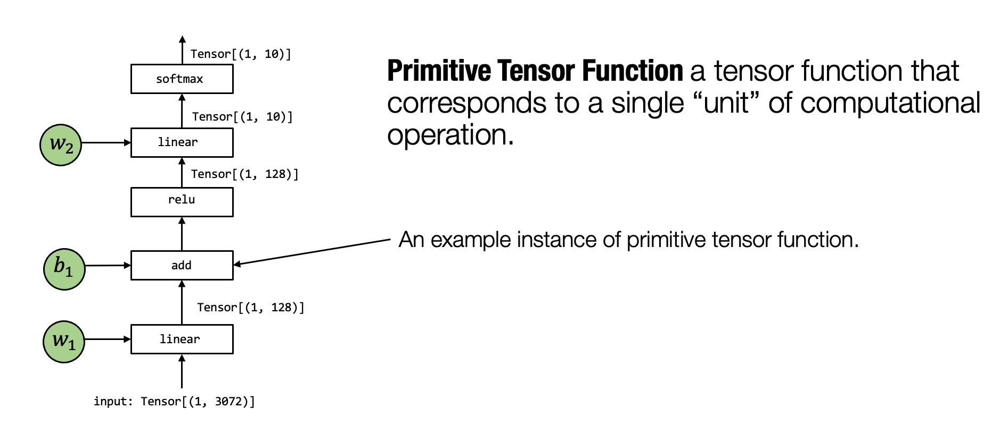
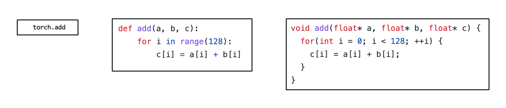
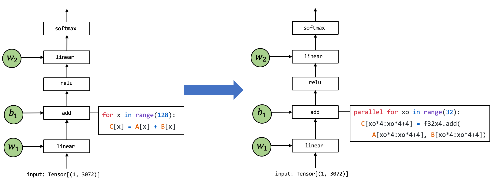
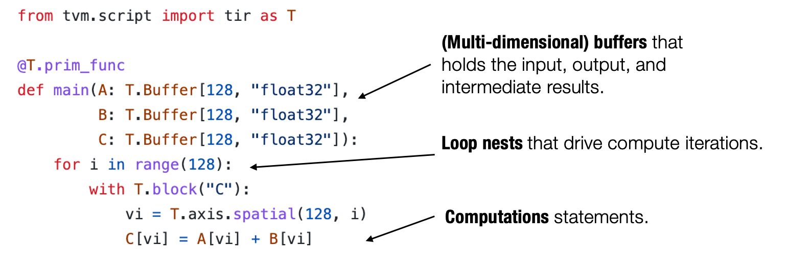
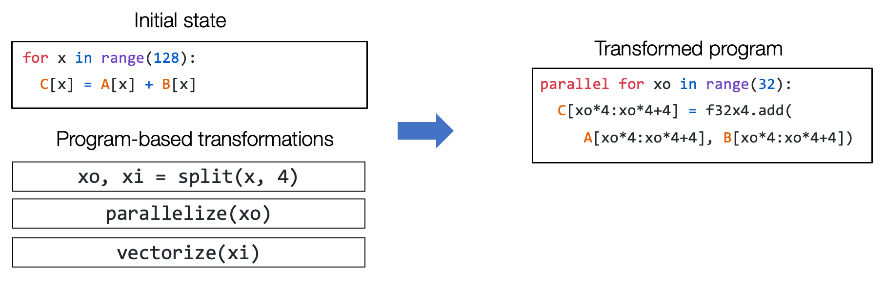
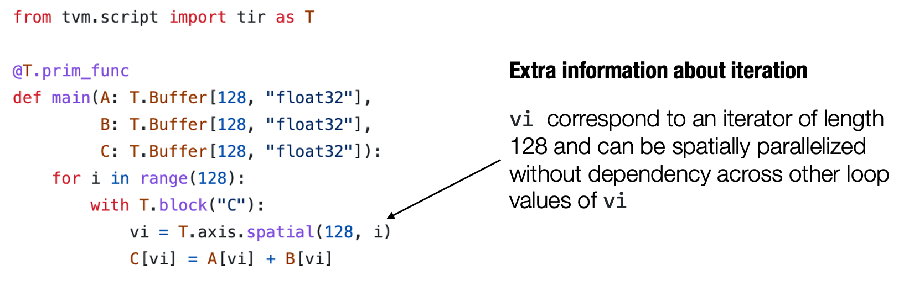

## 元张量函数

在上一章的概述中，我们介绍到机器学习编译的过程可以被看作张量函数之间的变换。一个典型的机器学习模型的执行包含许多步将输入张量之间转化为最终预测的计算步骤，其中的每一步都被称为元张量函数 (primitive tensor function)。

:label:`fig_primitive_tensor_func`

在上面这张图中，张量算子 `linear`, `add`, `relu` 和 `softmax` 均为元张量函数。特别的是，许多不同的抽象能够表示（和实现）同样的元张量函数（正如下图所示）。我们可以选择调用已经预先编译的框架库（如 `torch.add` 和 `numpy.add`）并利用在 Python 中的实现。在实践中，元张量函数被例如 C 或 C++ 的低级语言所实现，并且在一些时候会包含一些汇编代码。

:label:`fig_tensor_func_abstractions`

许多机器学习框架都提供机器学习模型的编译过程，以将元张量函数变换为更加专门的、针对特定工作和部署环境的函数。

:label:`fig_tensor_func_transformation`

上面这张图展示了一个元张量函数 `add` 的实现被变换至另一个不同实现的例子，其中在右侧的代码是一段表示可能的组合优化的伪代码：左侧代码中的循环被拆分出长度为 `4` 的单元，`f32x4.add` 对应的是一个特殊的执行向量加法计算的函数。

## 张量程序抽象

上一节谈到了对元张量函数变换的需要。为了让我们能够更有效地变换元张量函数，我们需要一个有效的抽象来表示这些函数。

通常来说，一个典型的元张量函数实现的抽象包含了以下成分：存储数据的多维数组，驱动张量计算的循环嵌套以及计算部分本身的语句。

:label:`fig_tensor_func_elements`

我们称这类抽象为**张量程序抽象**。张量程序抽象的一个重要性质是，他们能够被一系列有效的程序变换所改变。

:label:`fig_tensor_func_seq_transform`

例如，我们能够通过一组变换操作（如循环拆分、并行和向量化）将上图左侧的一个初始循环程序变换为右侧的程序。

### 张量程序抽象中的其它结构

重要的是，我们不能任意地对程序进行变换，比方说这可能是因为一些计算会依赖于循环之间的顺序。但幸运的是，我们所感兴趣的大多数元张量函数都具有良好的属性（例如循环迭代之间的独立性）。

张量程序可以将这些额外的信息合并为程序的一部分，以使程序变换更加便利。

:label:`fig_tensor_func_iteration`

举个例子，上面图中的程序包含额外的 `T.axis.spatial` 标注，表明 `vi` 这个特定的变量被映射到循环变量 `i`，并且所有的迭代都是独立的。这个信息对于执行这个程序而言并非必要，但会使得我们在变换这个程序时更加方便。在这个例子中，我们知道我们可以安全地并行或者重新排序所有与 `vi` 有关的循环，只要实际执行中 `vi` 的值按照从 `0` 到 `128` 的顺序变化。

## 总结

- 元张量函数表示机器学习模型计算中的单个单元计算。
  - 一个机器学习编译过程可以有选择地转换元张量函数的实现。
- 张量程序是一个表示元张量函数的有效抽象。
  - 关键成分包括: 多维数组，循环嵌套，计算语句。
  - 程序变换可以被用于加速张量程序的执行。
  - 张量程序中额外的结构能够为程序变换提供更多的信息。
